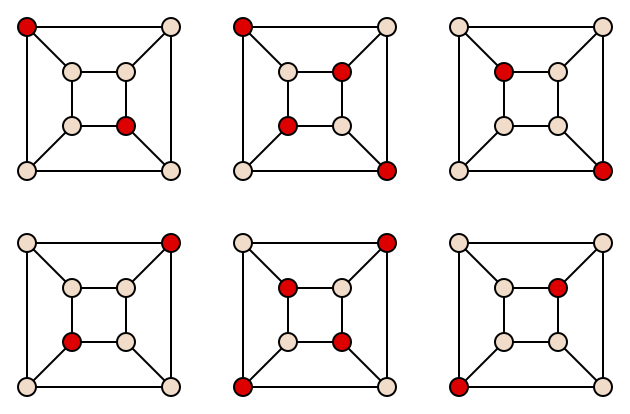
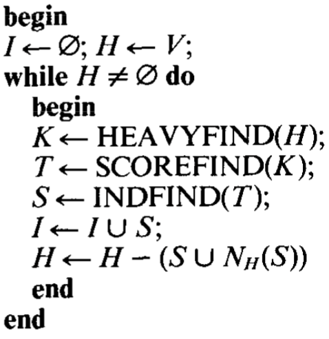
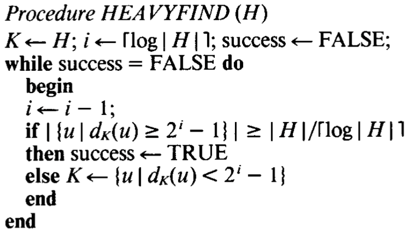
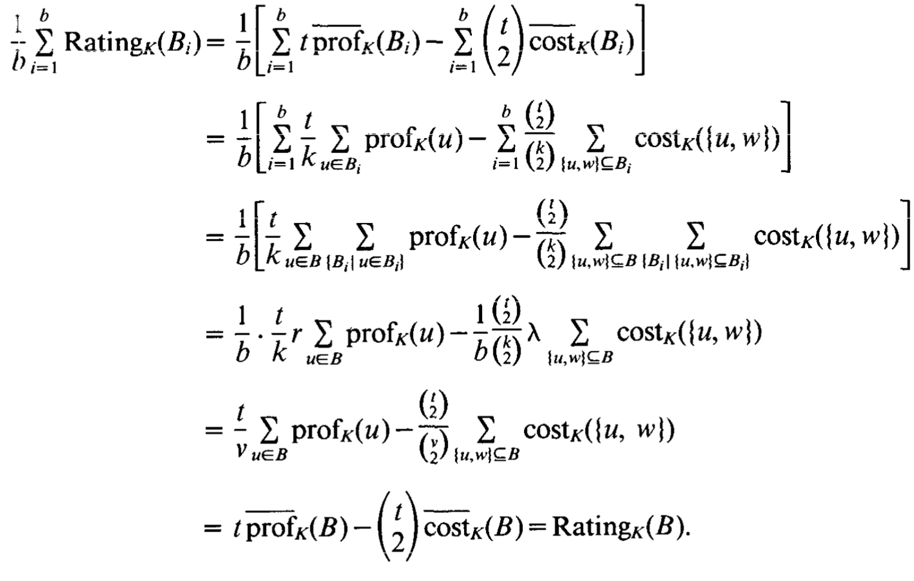

## MIS porblem

An  independent  set in  a graph  is a set of  vertices,  no  two  of  which  are adjacent.  A 
maximal independent  set is an independent set that  is  not  properly contained in 
any  independent set.

example:

## Karp And Wigderson algorithm

We use this alghorithm for solving maximal independent set in faster way. The algorithm execute in $O((log{}{n})^4)$ time and use $O((n/log{}{n})^3)$ processor.

you can see the overall view of this algorithm in the following picture:

According to the algorithm mentioned in the mentioned article, the `HEAVYFIND` function works as follows:

This function together with the ‍`SCOREFIND` function guarantees that there is an independent set whose size of its own set and the neighbors of the vertices inside it is equal to $N/log{}{N}$.

Notice that SCOREFING function calculate rating of blocks of vertices bu this function:

in `INDFIND` function we assign a processor to every edge and choose one of the two vertices and removes it.

NOTE: you can see more proofs and details in `KW85` paper.

## Benchmark
